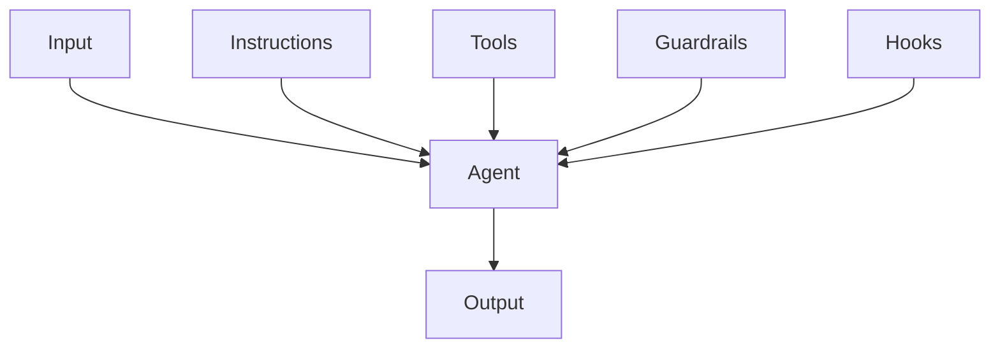
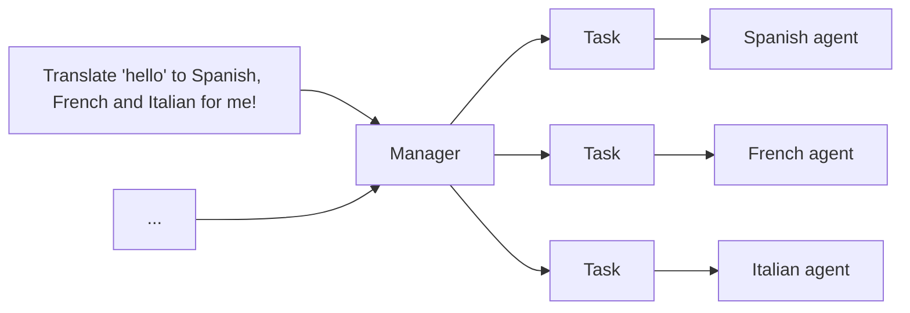
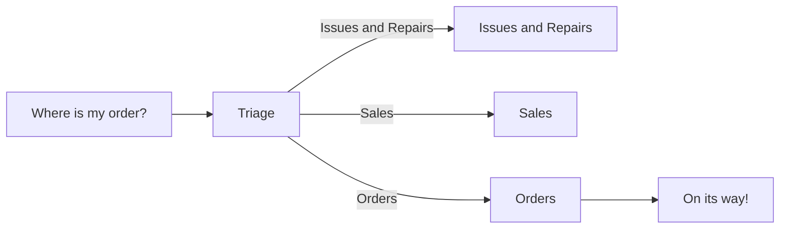

# AI Agent Design Patterns and Best Practices

## Principles

### First-Principles

From Lee Sedol vs. AlphaGo's Move 37, we can summarize [first-principles](https://www.chasewhughes.com/writing/beyond-the-replica-the-case-for-first-principles-agents) agent principles:

- **Replica agents**: Use biomimicry when workflows require human review, agents serve as copilots, or integrating with legacy UI-only tools
- **Alien agents**: Use first-principles when the goal is pure result efficiency

### Asymmetry of Verification and Verifiers

Asymmetry of verification and verifiers [law](https://www.jasonwei.net/blog/asymmetry-of-verification-and-verifiers-law):

All solvable and easily verifiable problems will be solved by AI.

:::caution[Agent Traffic]

[Among the agents](https://www.hyperdimensional.co/p/among-the-agents):

Value of highly polished UI and enterprise applications will decrease,
value of performant, reliable, extensible API will increase.

:::

## Patterns

Agent design [patterns](https://rlancemartin.github.io/2026/01/09/agent_design):

- Give agents a computer (CLI and files)
- Progressive disclosure
- Offload context
- Cache context
- Isolate context
- Evolve context

### Agent-native Architecture

[Agent-native](https://every.to/guides/agent-native) apps should:

- **Parity**: Users complete tasks via UI `<->` Agents implement via tools
- **Granularity**: Tools should be atomic primitives
- **Composability**: With above two, just write new prompts to create new features
- **Emergent capability**
- **Files as universal interface**: Files for legibility, databases for structure
- **Improvement over time**:
  - Accumulated context: State persists across sessions
  - Developer-level refinement: System prompts
  - User-level customization: User prompts

```md
**Who I Am**:
Reading assistant for the Every app.

**What I Know About This User**:
- Interested in military history and Russian literature
- Prefers concise analysis
- Currently reading *War and Peace*

**What Exists**:
- 12 notes in /notes
- Three active projects
- User preferences at /preferences.md

**Recent Activity**:
- User created "Project kickoff" (two hours ago)
- Analyzed passage about Austerlitz (yesterday)

**My Guidelines**:
- Don't spoil books they're reading
- Use their interests to personalize insights

**Current State**:
- No pending tasks
- Last sync: 10 minutes ago
```

:::tip[Agent-native Product]

Build capable foundation,
observe what users ask agent to do,
**formalize patterns** that emerge:

- Common patterns: Domain tools
- Frequent requests: Dedicated prompts
- Unused tools: Remove

:::

### Recursive Language Models

[RLM](https://www.primeintellect.ai/blog/rlm) achieves multi-hop reasoning code through divide-and-conquer and recursion, solving the `Context Rot` problem caused by long text.

## Instructions

- **Use existing documents**: Use existing operating procedures, support scripts, or policy documents to create LLM-friendly routines
- **Prompt agents to break down tasks**: Providing smaller, clearer steps helps minimize ambiguity and helps models better follow instructions
- **Define clear actions**: Ensure each step in the routine corresponds to a specific action or output
- **Capture edge cases**: Real interactions often produce decision points, and a robust routine predicts common variations and includes instructions on how to handle them through conditional steps or branches, e.g., providing alternative steps when required information is missing

```md
You are an LLM agent instruction writing expert.
Please convert the following help center document into a set of clear instructions, written as a numbered list.
This document will serve as a policy for the LLM to follow. Ensure no ambiguity, and the instructions are written in the form of agent directions.
The help center document to convert is as follows: {{help_center_doc}}
```

How to write a great `AGENTS.md` [lessons from over 2500 repositories](https://github.blog/ai-and-ml/github-copilot/how-to-write-a-great-agents-md-lessons-from-over-2500-repositories):

1. **States a clear role**: Defines who the agent is (expert technical writer), what skills it has (Markdown, TypeScript), and what it does (read code, write docs)
2. **Executable commands**: Gives AI tools it can run (`npm run docs:build` and `npx markdownlint docs/`). Commands come first
3. **Project knowledge**: Specifies tech stack with versions (React 18, TypeScript, Vite, Tailwind CSS) and exact file locations
4. **Real examples**: Shows what good output looks like with actual code. No abstract descriptions
5. **Three-tier boundaries**: Set clear rules using always do, ask first, never do. Prevents destructive mistakes

:::tip

Role -> Tool -> Context -> Example -> Boundary

:::

### Vibe Coding

1. **Spec the work**:
   - Goal: Picking next highest-leverage goal
   - Breakdown: Breaking work into small and verifiable slice (pull request)
   - Criteria: Writing acceptance criteria, e.g., inputs, outputs, edge cases, UX constraints
   - Risk: Calling out risks up front, e.g., performance hot-spots, security boundaries, migration concerns
2. **Give agents context**:
   - Repository: Repository conventions
   - Components: Component system, design tokens and patterns
   - Constraints: Defining constraints: what not to touch, what must stay backward compatible
3. **Direct agents `what`, not `how`**:
   - Tools: Assigning right tools
   - Files: Pointing relevant files and components
   - Constraints: Stating explicit guardrails, e.g., `don't change API shape`, `keep this behavior`, `no new deps`
4. **Verification and code review**:
   - Correctness: Edge cases, race conditions, error handling
   - Performance: `N+1` queries, unnecessary re-renders, overfetching
   - Security: Auth boundaries, injection, secrets, SSRF
   - Tests: Coverage for changed behaviors
5. **Integrate and ship**:
   - Break big work into tasks agents can complete reliably
   - Merge conflicts
   - Verify CI
   - Stage roll-outs
   - Monitor regressions

:::tip

Spec → Onboard → Direct → Verify → Integrate

:::

### System

OpenAI [Codex](https://openai.com/index/introducing-codex) system prompts:

- Instructions
- Git instructions
- `AGENTS.md` spec
- Citations instructions

### Coding

[Writing](https://github.com/agentsmd/agents.md) good [`AGENTS.md`](https://github.com/agentsmd/agents.md):

- `AGENTS.md` should define your project's **WHY**, **WHAT**, and **HOW**
- **Less is more**: Include as few instructions as reasonably possible in the file
- Keep the contents of your `AGENTS.md` **concise and universally applicable**
- Use **Progressive Disclosure**: Don't tell Agent all the information to know, tell Agent when it needs, how to find and use it
- Agent is not a linter: Use linters and code formatters, and use other features like [Hooks](https://code.claude.com/docs/en/hooks) and [Slash Commands](https://code.claude.com/docs/en/slash-commands)
- `AGENTS.md` is the highest leverage point of the harness, so avoid auto-generating it. You should carefully craft its contents for best results

### Pull Request

GitHub [Copilot](https://github.blog/ai-and-ml/github-copilot/how-to-use-github-copilot-spaces-to-debug-issues-faster) to debug issues faster:

```md
You are an experienced engineer working on this codebase.
Always ground your answers in the linked docs and sources in this space.
Before writing code, produce a 3–5 step plan that includes:

- The goal
- The approach
- The execution steps

Cite the exact files that justify your recommendations.
After I approve a plan, use the Copilot coding agent to propose a PR.
```

### Testing

```md
Create a test agent for this repository. It should:

- Have the persona of a QA software engineer
- Write tests for this codebase
- Run tests and analyze results
- Write to "/tests/" directory only
- Never modify source code or remove failing tests
- Include specific examples of good test structure
```

### Research

AI agents powered by tricky LLMs prompting:

- [Deep research agent](https://github.com/anthropics/claude-cookbooks/tree/main/patterns/agents) from Claude agents cookbook
- [DeepCode](https://github.com/HKUDS/DeepCode): Open agentic coding
- [Generative agent](https://github.com/joonspk-research/generative_agents)
- [Minecraft agent](https://github.com/MineDojo/Voyager)

## Tool

[Tool execution](https://www.youtube.com/watch?v=TqC1qOfiVcQ):

1. Tool calling: Atomic toolkit
2. Bash: Composable static scripts
3. Codegen: Dynamic programs

## Context

### Dynamic Discovery

Dynamic context [discovery](https://cursor.com/cn/blog/dynamic-context-discovery):

- Tool response → File
- Terminal session → File
- Reference conversation history when context compression
- Load on demand
- Progressive disclosure

### Personalization

Metaprompting for [memory extraction](https://cookbook.openai.com/examples/agents_sdk/context_personalization#2-shape-of-a-memory):

```md
You are a [USE CASE] agent whose goal is [GOAL].
What information would be important to keep in working memory during a single session?
List both fixed attributes (always needed) and inferred attributes (derived from user behavior or context).
```

:::tip[Memory System]

[Memory system](https://cookbook.openai.com/examples/agents_sdk/context_personalization#memory-guardrails):

- Repeatable memory loop: Inject → Reason → Distill → Consolidate
- Enforce precedence: Current user message > Session context > Memory

:::

### Context Engineering

LLMs do not uniformly utilize their context, their accuracy and reliability [decline as the number of input tokens increases](https://research.trychroma.com/context-rot), called **Context Rot**.

Therefore, merely having relevant information in the model's context is insufficient: the presentation of information significantly impacts performance. This highlights the necessity of **context engineering** to optimize the amount of relevant information and minimize irrelevant context for reliable performance, e.g., custom Gemini CLI command.

:::tip[Planning with Files]

[Manus](https://manus.im/blog/Context-Engineering-for-AI-Agents-Lessons-from-Building-Manus):

1. Design around **KV-cache**
2. **Plan** is required
3. **Files** are memory
4. Don't get few-shotted: Get rid of repetitive actions
5. Manipulate attention through **recitation**

```md
Start of context: [Original goal - far away, forgotten]
...many tool calls...
End of context: [Recently read task_plan.md - gets ATTENTION!]
```

:::

## Workflow

### Plan Mode

Claude code `EnterPlanMode` system prompt:

```md
Entered plan mode. You should now focus on exploring the codebase and designing an implementation approach.

In plan mode, you should:
1. Thoroughly explore the codebase to understand existing patterns
2. Identify similar features and architectural approaches
3. Consider multiple approaches and their trade-offs
4. Use AskUserQuestion if you need to clarify the approach
5. Design a concrete implementation strategy
6. When ready, use ExitPlanMode to present your plan for approval

Remember: DO NOT write or edit any files yet. This is a read-only exploration and planning phase.
```

### Debug Mode

Cursor [debug mode](https://cursor.com/blog/agent-best-practices#bug-debug-mode):

1. **Assume**: Generate multiple hypotheses
2. **Log**: Add logging points
3. **Collect**: Collect runtime data (log, trace, profile)
4. **Locate**: Reproduce bug, analyze actual behavior, precisely locate root cause
5. **Fix**: Based on evidence, make targeted fixes

### TDD

[Test-driven development](https://cursor.com/cn/blog/agent-best-practices):

1. **Write tests**: Have the agent write tests based on expected input/output pairs. Clearly state you're doing TDD, to avoid agent writing mock implementations for features that don't exist yet
2. **Run tests**: Have the agent run tests and confirm tests actually fail. Clearly state not to write implementation code at this stage
3. **Commit tests**
4. **Write code**: Have the agent write code to pass tests, and instruct it not to modify tests. Tell it to iterate until all tests pass
5. **Submit code**

## Orchestration

### Single-agent Systems



### Multi-agent Systems: Manager Pattern

Other agents act as tools, called by the central agent:



```python
from agents import Agent, Runner

manager_agent = Agent(
  name="manager_agent",
  instructions=(
    "You are a translation agent. You use given tools to translate."
    "If multiple translations are requested, you will call relevant tools."
  ),
  tools=[
    spanish_agent.as_tool(
      tool_name="translate_to_spanish",
      tool_description="Translate user's message to Spanish",
    ),
    french_agent.as_tool(
      tool_name="translate_to_french",
      tool_description="Translate user's message to French",
    ),
    italian_agent.as_tool(
      tool_name="translate_to_italian",
      tool_description="Translate user's message to Italian",
    ),
  ],
)

async def main():
  msg = input("Translate 'hello' to Spanish, French and Italian for me!")

  orchestrator_output = await Runner.run(manager_agent, msg)

  for message in orchestrator_output.new_messages:
    print(f"Translation step: {message.content}")
```

### Multi-agent Systems: Decentralized Pattern

Multiple agents run as peers:



```python
from agents import Agent, Runner

technical_support_agent = Agent(
  name="Technical Support Agent",
  instructions=(
    "You provide expert assistance for solving technical problems, "
    "system outages, or product troubleshooting."
  ),
  tools=[search_knowledge_base]
)

sales_assistant_agent = Agent(
  name="Sales Assistant Agent",
  instructions=(
    "You help business customers browse product catalogs, "
    "recommend appropriate solutions, and facilitate purchase transactions."
  ),
  tools=[initiate_purchase_order]
)

order_management_agent = Agent(
  name="Order Management Agent",
  instructions=(
    "You assist customers with order tracking, delivery schedules, "
    "and handling returns or refunds."
  ),
  tools=[track_order_status, initiate_refund_process]
)

triage_agent = Agent(
  name="Triage Agent",
  instructions="You serve as the first point of contact, assessing customer queries and quickly routing them to the appropriate specialized agent.",
  handoffs=[technical_support_agent, sales_assistant_agent, order_management_agent],
)

await Runner.run(triage_agent, input("Can you provide an update on the delivery schedule for my recent purchase?"))
```

## Guardrails

### Building Guardrails

- **Relevance classifier**: Ensures agent responses stay within expected scope by flagging off-topic queries
- **Safety classifier**: Detects unsafe inputs attempting to exploit the system (jailbreaks or prompt injection)
- **PII filter**: Prevents unnecessary personal identity information leakage by reviewing model output for any potential PII
- **Content moderation**: Flags harmful or inappropriate inputs (hate speech, harassment, violence) to maintain safe, respectful interactions
- **Tool safety measures**: Evaluate risk of each tool available to your agent by assigning low, medium, or high ratings based on factors like read-only vs. write access, reversibility, required account permissions, and financial impact. Use these risk ratings to trigger automated actions like pausing for guardrail checks before high-risk feature execution, or escalating to human intervention when needed
- **Rule-based protection**: Simple deterministic measures (blacklists, input length limits, regex filters) to prevent known threats like prohibited terms or SQL injection
- **Output validation**: Ensure responses align with brand values through prompt engineering and content checks, preventing outputs that could damage brand integrity

```python
from agents import (
  Agent,
  GuardrailFunctionOutput,
  InputGuardrailTripwireTriggered,
  RunContextWrapper,
  Runner,
  TResponseInputItem,
  input_guardrail,
  Guardrail,
  GuardrailTripwireTriggered
)
from pydantic import BaseModel

class ChurnDetectionOutput(BaseModel):
  is_churn_risk: bool
  reasoning: str

churn_detection_agent = Agent(
  name="Churn Detection Agent",
  instructions="Identify whether a user message indicates potential customer churn risk.",
  output_type=ChurnDetectionOutput,
)

@input_guardrail
async def churn_detection_tripwire(
   ctx: RunContextWrapper[None],
   agent: Agent,
   input: str | list[TResponseInputItem]
) -> GuardrailFunctionOutput:
  result = await Runner.run(churn_detection_agent, input, context=ctx.context)

  return GuardrailFunctionOutput(
    output_info=result.final_output,
    tripwire_triggered=result.final_output.is_churn_risk,
  )

customer_support_agent = Agent(
  name="Customer support agent",
  instructions="You are a customer support agent. You help customers resolve their issues.",
  input_guardrails=[Guardrail(guardrail_function=churn_detection_tripwire)]
)

async def main():
  # This should be fine
  await Runner.run(customer_support_agent, "Hello!")
  print("Hello message passed")

  # This should trigger the guardrail
  try:
    await Runner.run(customer_support_agent, "I want to cancel my subscription")
    print("Guardrail not triggered - this is unexpected")
  except GuardrailTripwireTriggered:
    print("Churn detection guardrail triggered")
```

Triggering a human intervention plan when exceeding failure thresholds or high-risk operations is a critical safety measure.

## Evaluation

Agents [eval](https://www.anthropic.com/engineering/demystifying-evals-for-ai-agents):

1. Start early
2. Source realistic tasks from failures
3. Define unambiguous, robust success criteria
4. Design graders thoughtfully and combine multiple types (code-based, model-based, human)
5. Make sure the problems are hard enough for model
6. Iterate on evaluations to improve signal-to-noise ratio
7. Read transcripts
8. Pick framework: [prompt foo](https://github.com/promptfoo/promptfoo), [harbor](https://github.com/laude-institute/harbor)

When building agents, [trace](https://x.com/hwchase17/status/2010044779225329688) is the source of truth:

- Debugging becomes trace analysis
- Testing becomes eval-driven
- Can't set breakpoints in reasoning
- Performance optimization changes: task success rate, reasoning quality, tool usage efficiency

## Benchmarks

[Benchmarks](https://blog.sshh.io/p/understanding-ai-benchmarks):

- **Aggregate**: Don't obsess over a 1-2% lead on one benchmark, focus on specific and comprehensive domain
- **Relative**: Compare within the same model family or lab, how did the score change from v1 to v2?
- **Verify**: The only benchmark that matters at the end of the day is your workload

## Libraries

### Instruction

- [AGENTS.md](https://github.com/agentsmd/agents.md): Open format for guiding coding agents
- [llms.txt](https://github.com/AnswerDotAI/llms-txt): Helping language models use website
- [System](https://github.com/x1xhlol/system-prompts-and-models-of-ai-tools): System prompts for AI agents

### RAG

- [RAGFlow](https://github.com/infiniflow/ragflow): Superior context layer for AI agents

### Project

- [VibeKanban](http://github.com/BloopAI/vibe-kanban): Run coding agents in parallel without conflicts, and perform code review

### Documentation

- [DeepWiki](https://github.com/AsyncFuncAI/deepwiki-open)
- [ZRead](https://zread.ai): AI-powered GitHub repository reader

### Slide

- [Banana](https://github.com/Anionex/banana-slides): AI-native PPT generator based on nano banana pro

## References

- Vibe coding [prompts](https://docs.google.com/spreadsheets/d/1ngoQOhJqdguwNAilCl1joNwTje7FWWN9WiI2bo5VhpU)
- Vibe coding [guide](https://github.com/tukuaiai/vibe-coding-cn)
- Agent system [prompts](https://github.com/x1xhlol/system-prompts-and-models-of-ai-tools)
