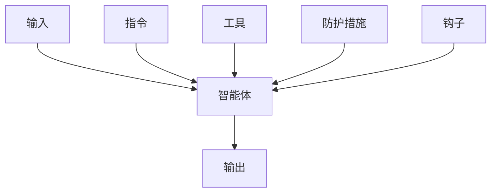
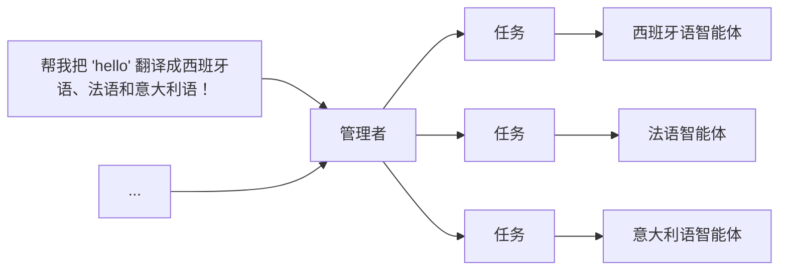
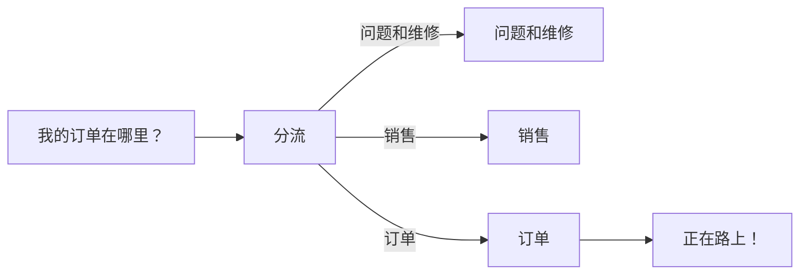

# LLM 基础笔记

## 生成式 AI

### 生成模型

- 自回归（AR）模型：
  一次生成一个 token 的输出，基于先前的 tokens。
- 非自回归（NAR）模型：
  并行一次性生成所有输出，不依赖先前的 tokens。

|             | AR 模型 | NAR 模型 |
| ----------- | :-----: | :------: |
| 并行性      |   低    |    高    |
| 速度        |   慢    |    快    |
| 质量        |   高    |    低    |

结合上述两种方法（Encoder + Decoder 架构）：

- 用 AR model 生成中间向量，用 NAR model 生成最终输出。
- 用 NAR model 多次生成，逐步优化输出。
- 推测解码（Speculative decoding）：
  用 NAR model 快速生成若干个预测输出，作为 AR model 的后续输入，
  使得 AR model 可以同时输出多个结果。

### 扩展法则

现有的预训练语言模型对于数据的需求量远高于扩展法则
（例如 [Chinchilla](https://nips.cc/virtual/2022/53031)）中所给出的估计规模。
很多更小的模型也能够通过使用超大规模的预训练数据获得较大的模型性能提升。
这种现象的一个重要原因是由于 Transformer 架构具有较好的数据扩展性。
目前为止，还没有实验能够有效验证特定参数规模语言模型的饱和数据规模
（即随着数据规模的扩展，模型性能不再提升）。

### 涌现能力

大语言模型的涌现能力被非形式化定义为
`在小型模型中不存在但在大模型中出现的能力`：

- 上下文学习（In-context learning）。
- 指令遵循（Instruction following）。
- 逐步推理（Step-by-step reasoning）。

### ChatGPT

在对话数据上微调的 GPT 模型：

- 预训练（Pre-training）：
  学习文字接龙，学习大规模资料（自监督学习），生成下一个单词。
- 指令微调（Instruction-tuning，IT）：
  人工文字接龙，人工标注部分问题的答案（监督学习），引导模型生成的方向。
- 基于人类反馈的强化学习
  （[RLHF](https://nips.cc/virtual/2022/52886)）：
  训练一个奖励模型（reward model），负责评价模型生成的答案，提供人类反馈。
  以 reward model 的评价分数为奖励，通过强化学习优化模型。
  一般聚焦于三个方面：有用性（Helpfulness）、诚实性（Honesty）、无害性（Harmlessness）。

:::tip[对齐（Alignment）]

使用标注数据进行指令微调（IT）的监督学习，
以及基于人类反馈的强化学习（RLHF）。

:::

### 扩散模型

- 前向过程（扩散）+ 反向过程（去噪）。
- 稳定扩散模型。

### 视频模型

生成视频作为世界模型模拟器。

## LLM 工具链

### LangChain

[LangChain](https://upstash.com/blog/langchain-explained)
旨在让使用 LLM 编程变得更容易。

模型 I/O 模块
规范化 LLM 输入（例如提示词）、API 和输出（例如补全）：

```ts
import { CommaSeparatedListOutputParser } from '@langchain/core/output_parsers'
import { PromptTemplate } from '@langchain/core/prompts'
import { OpenAI } from '@langchain/openai'

const template = PromptTemplate.fromTemplate('列出 10 个 {subject}。\n{format_instructions}')
const model = new OpenAI({ temperature: 0 })
const listParser = new CommaSeparatedListOutputParser()

const prompt = await template.format({
  subject: '国家',
  format_instructions: listParser.getFormatInstructions(),
})

const result = await model.invoke(prompt)
const listResult = await listParser.parse(result)
```

检索模块
帮助处理数据和用户输入，
使检索相关信息变得更容易：

```ts
import { UpstashVectorStore } from '@langchain/community/vectorstores/upstash'
import { OpenAIEmbeddings } from '@langchain/openai'
import { CSVLoader } from 'langchain/document_loaders/fs/csv'
import { ScoreThresholdRetriever } from 'langchain/retrievers/score_threshold'
import { RecursiveCharacterTextSplitter } from 'langchain/text_splitter'

// CSV 数据
const loader = new CSVLoader('path/to/example.csv')
const docs = await loader.load()

// 文本分割器
const splitter = new RecursiveCharacterTextSplitter({
  chunkSize: 10,
  chunkOverlap: 1,
})
const docs = await splitter.createDocuments(['...'])

// 嵌入和向量存储
const vectorStore = new UpstashVectorStore(new OpenAIEmbeddings())
await vectorStore.addDocuments(docs)
const retriever = ScoreThresholdRetriever.fromVectorStore(vectorStore, {
  minSimilarityScore: 0.9,
})
const result = await retriever.getRelevantDocuments('...?')
```

链模块
将任务链接在一起：

```ts
import { CommaSeparatedListOutputParser } from '@langchain/core/output_parsers'
import { PromptTemplate } from '@langchain/core/prompts'
import { RunnableSequence } from '@langchain/core/runnables'
import { OpenAI } from '@langchain/openai'

const template = PromptTemplate.fromTemplate('列出 10 个 {subject}。\n{format_instructions}')
const model = new OpenAI({ temperature: 0 })
const listParser = new CommaSeparatedListOutputParser()

const chain = RunnableSequence.from([template, model, listParser])

const result = await chain.invoke({
  subject: '国家',
  format_instructions: listParser.getFormatInstructions(),
})
```

智能体模块
是带有函数列表（称为工具）的链，它可以执行这些函数，
而链是硬编码的，
智能体在 LLM 的帮助下选择其操作：

```ts
import { createVectorStoreAgent, VectorStoreToolkit } from 'langchain/agents'

const toolkit = new VectorStoreToolkit({ name: '演示数据', vectorStore }, model)
const agent = createVectorStoreAgent(model, toolkit)

const result = await agent.invoke({ input: '...' })
```

### LLM 平台

- OpenAI GPT [API](https://platform.openai.com)。
- Google Gemini [API](https://ai.google.dev)。

## AI 智能体

由巧妙的 LLM 提示词驱动的 AI 智能体：

- 生成式[智能体](https://github.com/joonspk-research/generative_agents)。
- Minecraft [智能体](https://github.com/MineDojo/Voyager)。

### 智能体指令

- 使用现有文档：
  使用现有的操作程序、支持脚本或政策文档来创建 LLM 友好的例程（routines）。
- 提示智能体分解任务：
  提供更小、更清晰的步骤有助于最大限度地减少歧义，并帮助模型更好地遵循指令。
- 定义清晰的操作：
  确保例程中的每一步都对应一个特定的行动或输出。
- 捕获边缘情况：
  实际交互通常会产生决策点，一个健壮的例程会预测常见的变化，
  并包含关于如何通过条件步骤或分支来处理它们的指令，例如在缺少所需信息时提供替代步骤。

```markdown
您是 LLM 智能体指令编写专家。
请将以下帮助中心文档转换为一组清晰的指令，以编号列表形式编写。
该文档将成为 LLM 遵循的政策。确保没有歧义，并且指令是以智能体的指示形式编写的。
要转换的帮助中心文档如下 {{help_center_doc}}
```

### 智能体编排

单智能体系统（Single-agent systems）：



多智能体系统中心模式（Multi-agent systems in manager pattern）：
其余智能体作为工具，由中心智能体调用：



```python
from agents import Agent, Runner

manager_agent = Agent(
  name="manager_agent",
  instructions=(
    "您是一名翻译代理。您使用给定的工具进行翻译。"
    "如果要求进行多次翻译，您将调用相关工具。"
  ),
  tools=[
    spanish_agent.as_tool(
      tool_name="translate_to_spanish",
      tool_description="将用户的消息翻译成西班牙语",
    ),
    french_agent.as_tool(
      tool_name="translate_to_french",
      tool_description="将用户的消息翻译成法语",
    ),
    italian_agent.as_tool(
      tool_name="translate_to_italian",
      tool_description="将用户的消息翻译成意大利语",
    ),
  ],
)

async def main():
  msg = input("帮我把 'hello' 翻译成西班牙语、法语和意大利语！")

  orchestrator_output = await Runner.run(manager_agent, msg)

  for message in orchestrator_output.new_messages:
    print(f"翻译步骤：{message.content}")
```

多智能体系统去中心模式（Multi-agent systems in decentralized pattern），
多个代理作为对等体运行：



```python
from agents import Agent, Runner

technical_support_agent = Agent(
  name="技术支持智能体",
  instructions=(
    "您提供解决技术问题、系统中断或产品故障排除的专家协助。"
  ),
  tools=[search_knowledge_base]
)

sales_assistant_agent = Agent(
  name="销售助理智能体",
  instructions=(
    "您帮助企业客户浏览产品目录、推荐合适的解决方案并促成购买交易。"
  ),
  tools=[initiate_purchase_order]
)

order_management_agent = Agent(
  name="订单管理智能体",
  instructions=(
    "您协助客户查询订单跟踪、交付时间表以及处理退货或退款。"
  )
)

tools=[track_order_status, initiate_refund_process]

triage_agent = Agent(
  name="分流智能体",
  instructions="您作为第一个接触点，评估客户查询并迅速将其引导至正确的专业代理。",
  handoffs=[technical_support_agent, sales_assistant_agent, order_management_agent],
)

await Runner.run(triage_agent, input("您能提供我最近购买商品的配送时间表更新吗？"))
```

### 智能体防护措施

构建防护措施：

- 相关性分类器：
  确保智能体响应保持在预期范围内，通过标记偏离主题的查询。
- 安全分类器：
  检测试图利用系统漏洞的不安全输入（越狱或提示注入）。
- PII 过滤器：
  通过审查模型输出中任何潜在的个人身份信息（PII），防止不必要的个人身份信息泄露。
- 内容审核：
  标记有害或不当的输入（仇恨言论、骚扰、暴力），以保持安全、尊重的互动。
- 工具安全措施：
  通过评估您代理可用的每个工具的风险，
  并根据只读与写入访问、可逆性、所需的账户权限和财务影响等因素分配低、中或高评级。
  使用这些风险评级来触发自动化操作，
  例如在高风险功能执行前暂停进行防护措施检查，或在需要时升级到人工干预。
- 基于规则的保护：
  简单的确定性措施（黑名单、输入长度限制、正则表达式过滤器）以防止已知的威胁，
  如禁止的术语或 SQL 注入。
- 输出验证：
  通过提示工程和内容检查确保响应与品牌价值一致，防止可能损害品牌完整性的输出。

```python
from agents import (
  Agent,
  GuardrailFunctionOutput,
  InputGuardrailTripwireTriggered,
  RunContextWrapper,
  Runner,
  TResponseInputItem,
  input_guardrail,
  Guardrail,
  GuardrailTripwireTriggered
)
from pydantic import BaseModel

class ChurnDetectionOutput(BaseModel):
  is_churn_risk: bool
  reasoning: str

churn_detection_agent = Agent(
  name="流失检测智能体",
  instructions="识别用户消息是否表示潜在的客户流失风险。",
  output_type=ChurnDetectionOutput,
)

@input_guardrail
async def churn_detection_tripwire(
   ctx: RunContextWrapper[None],
   agent: Agent,
   input: str | list[TResponseInputItem]
) -> GuardrailFunctionOutput:
  result = await Runner.run(churn_detection_agent, input, context=ctx.context)

  return GuardrailFunctionOutput(
    output_info=result.final_output,
    tripwire_triggered=result.final_output.is_churn_risk,
  )

customer_support_agent = Agent(
  name="客户支持智能体",
  instructions="您是客户支持代理。您帮助客户解决他们的问题。",
  input_guardrails=[Guardrail(guardrail_function=churn_detection_tripwire)]
)

async def main():
  # 这应该没问题
  await Runner.run(customer_support_agent, "你好！")
  print("你好消息已通过")

  # 这应该触发防护措施
  try:
    await Runner.run(customer_support_agent, "我想取消订阅")
    print("防护措施未触发 - 这是意料之外的")
  except GuardrailTripwireTriggered:
    print("流失检测防护措施已触发")
```

当超出失败阈值或高风险操作时，触发人工干预计划，是一项关键的安全保障措施。

## MCP 服务器

- [顺序思考](https://github.com/modelcontextprotocol/servers/tree/main/src/sequentialthinking)。
- [Context7](https://github.com/upstash/context7)。
- [Playwright](https://github.com/microsoft/playwright-mcp)。
- [Puppeteer](https://github.com/modelcontextprotocol/servers/tree/main/src/puppeteer)。
- [浏览器工具](https://github.com/AgentDeskAI/browser-tools-mcp)。
- [StageWise](https://github.com/stagewise-io/stagewise)。
- [Git](https://github.com/modelcontextprotocol/servers/tree/main/src/git)。
- [GitHub](https://github.com/github/github-mcp-server)。
- [MySQL](https://github.com/benborla/mcp-server-mysql)。
- [Figma](https://help.figma.com/hc/en-us/articles/32132100833559-Guide-to-the-Dev-Mode-MCP-Server)。
- [Notion](https://github.com/makenotion/notion-mcp-server)。
- [APIFox](https://github.com/apifox/apifox-mcp-server)。

## LLM 工具

### 文档

- [DeepWiki](https://github.com/AsyncFuncAI/deepwiki-open)。

## LLM 参考

- LLM 综述：[大语言模型](https://github.com/LLMBook-zh/LLMBook-zh.github.io)。
