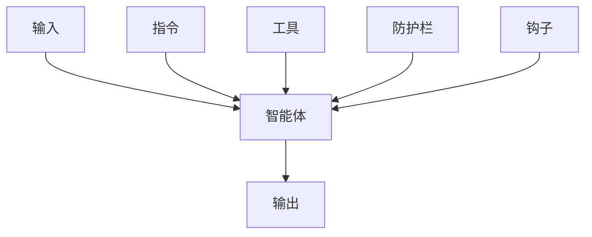
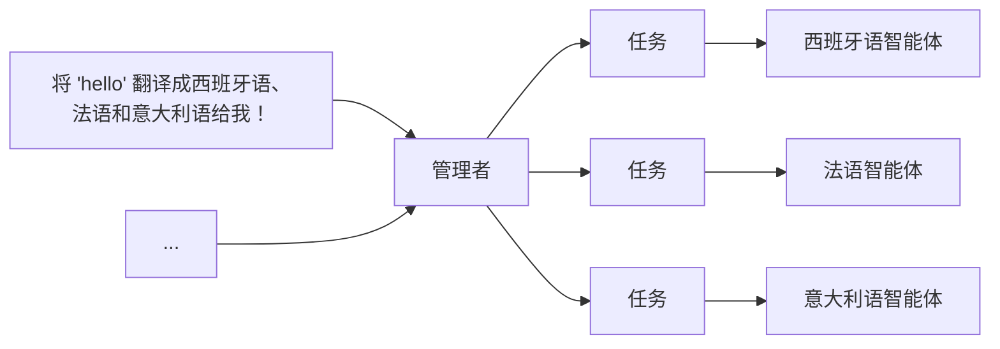
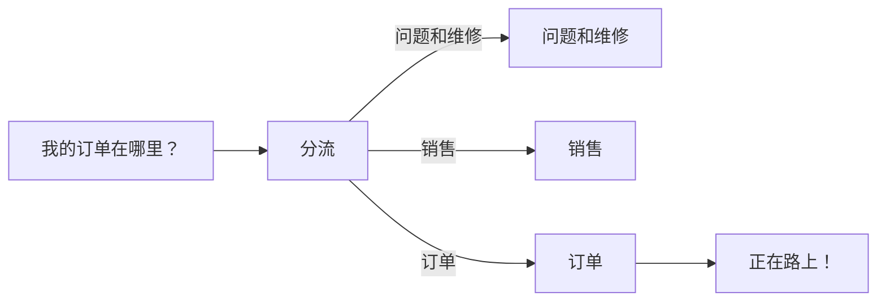

# AI 智能体设计模式与最佳实践

## 核心原则

### 第一性原理

从李世石与 AlphaGo 的围棋对战中的第 37 手，我们可以总结出[第一性原理](https://www.chasewhughes.com/writing/beyond-the-replica-the-case-for-first-principles-agents)智能体的基本原则：

- **仿生智能体 (Replica agents)**：当流程需要人工审核、代理作为用户的副驾驶员或与仅限 UI 的旧版工具集成时，使用仿生学
- **外星智能体 (Alien agents)**：当目标是纯粹的结果效率时，使用第一性原理

### 验证不对称性定律

验证与验证者的不对称性[定律](https://www.jasonwei.net/blog/asymmetry-of-verification-and-verifiers-law)：

所有可解决且易于验证的问题，都将被 AI 解决。

:::caution[智能体流量]

[智能体之间](https://www.hyperdimensional.co/p/among-the-agents)：

高度完善的 UI 和企业应用的价值将下降，
高性能、可靠、可扩展的 API 的价值将上升。

:::

## 设计模式

智能体设计[模式](https://rlancemartin.github.io/2026/01/09/agent_design)：

- 给智能体一台计算机（CLI 和文件）
- 渐进式披露
- 卸载上下文
- 缓存上下文
- 隔离上下文
- 演化上下文

### 智能体原生架构

[智能体原生](https://every.to/guides/agent-native)应用应该：

- **对等性 (Parity)**：用户通过 UI 完成任务 `<->` 智能体通过工具实现
- **细粒度 (Granularity)**：工具应该是原子原语
- **可组合性**：有了以上两点，只需编写新的提示词即可创建新功能
- **涌现能力**
- **文件作为通用接口**：文件用于可读性，数据库用于结构
- **随时间改进**：
  - 累积上下文：状态在会话之间持续存在
  - 开发者级优化：系统提示词
  - 用户级定制：用户提示词

```md
**我是谁**：
Every 应用的阅读助手。

**我对该用户的了解**：
- 对军事历史和俄罗斯文学感兴趣
- 偏好简洁分析
- 正在阅读《战争与和平》

**现有内容**：
- /notes 中有 12 条笔记
- 三个活跃项目
- /preferences.md 中的用户偏好设置

**最近活动**：
- 用户创建了"项目启动"（两小时前）
- 分析了关于奥斯特里茨的段落（昨天）

**我的指导原则**：
- 不要剧透他们正在读的书
- 利用他们的兴趣来个性化见解

**当前状态**：
- 无待处理任务
- 最后同步：10 分钟前
```

:::tip[智能体原生产品]

构建强大的基础，
观察用户要求智能体做什么，
**将涌现的模式形式化**：

- 常见模式：领域工具
- 频繁请求：专用提示词
- 未使用的工具：删除

:::

### 递归语言模型

[RLM](https://www.primeintellect.ai/blog/rlm) 通过分治与递归，实现多跳推理代码，解决长文本带来的 `上下文腐烂` 问题。

## 指令编写

- **使用现有文档**：使用现有的操作程序、支持脚本或政策文档来创建 LLM 友好的例行程序
- **提示智能体分解任务**：提供更小、更清晰的步骤有助于最大限度地减少歧义，并帮助模型更好地遵循指令
- **定义清晰的行动**：确保例行程序中的每一步都对应一个特定的行动或输出
- **捕获边缘情况**：实际交互通常会产生决策点，一个健壮的例行程序会预测常见的变化，并包含关于如何通过条件步骤或分支来处理它们的指令，例如在缺少所需信息时提供替代步骤

```md
您是 LLM 智能体指令编写专家。
请将以下帮助中心文档转换为一组清晰的指令，以编号列表形式编写。
该文档将成为 LLM 遵循的政策。确保没有歧义，并且指令是以智能体的指示形式编写的。
要转换的帮助中心文档如下 {{help_center_doc}}
```

如何编写优秀的 `AGENTS.md` [来自超过 2500 个仓库的经验教训](https://github.blog/ai-and-ml/github-copilot/how-to-write-a-great-agents-md-lessons-from-over-2500-repositories)：

1. **明确角色**：定义智能体是谁（专家技术作家），拥有什么技能（Markdown、TypeScript），以及做什么（阅读代码、编写文档）
2. **可执行命令**：给 AI 可以运行的工具（`npm run docs:build` 和 `npx markdownlint docs/`）。命令排在第一位
3. **项目知识**：指定带有版本的技术栈（React 18、TypeScript、Vite、Tailwind CSS）和确切的文件位置
4. **真实示例**：使用实际代码展示好的输出是什么样的。没有抽象描述
5. **三层边界**：使用始终做、先问、从不做来设置清晰的规则。防止破坏性错误

:::tip

角色 → 工具 → 上下文 → 示例 → 边界

:::

### Vibe Coding

1. **规范工作**：
   - 目标：选择下一个最高杠杆目标
   - 分解：将工作分解为小的、可验证的切片（拉取请求）
   - 标准：编写验收标准，例如输入、输出、边缘情况、UX 约束
   - 风险：提前指出风险，例如性能热点、安全边界、迁移问题
2. **给智能体上下文**：
   - 仓库：仓库约定
   - 组件：组件系统、设计令牌和模式
   - 约束：定义约束：什么不能碰，什么必须保持向后兼容
3. **指导智能体"做什么"，而不是"怎么做"**：
   - 工具：分配正确的工具
   - 文件：指向相关文件和组件
   - 约束：说明明确的防护栏，例如 `不要更改 API 形状`、`保持此行为`、`没有新依赖`
4. **验证和代码审查**：
   - 正确性：边缘情况、竞争条件、错误处理
   - 性能：`N+1` 查询、不必要的重新渲染、过度获取
   - 安全性：认证边界、注入、机密、SSRF
   - 测试：更改行为的覆盖率
5. **集成和发布**：
   - 将大工作分解为智能体可以可靠完成的任务
   - 合并冲突
   - 验证 CI
   - 分阶段推出
   - 监控回归

:::tip

规范 → 上手 → 指导 → 验证 → 集成

:::

### 系统

OpenAI [Codex](https://openai.com/index/introducing-codex) 系统提示词：

- 指令
- Git 指令
- `AGENTS.md` 规范
- 引用指令

### 编码

[编写](https://github.com/agentsmd/agents.md)优秀的 [`AGENTS.md`](https://github.com/agentsmd/agents.md)：

- `AGENTS.md` 应该定义项目的 **为什么**、**是什么**和**怎么做**
- **少即是多**：在文件中包含尽可能少的合理指令
- 保持 `AGENTS.md` 的内容**简洁且普遍适用**
- 使用**渐进式披露**：不要告诉智能体所有要知道的信息，告诉智能体什么时候需要，如何找到和使用它
- 智能体不是 linter：使用 linter 和代码格式化程序，以及其他功能如 [Hooks](https://code.claude.com/docs/en/hooks) 和 [Slash Commands](https://code.claude.com/docs/en/slash-commands)
- `AGENTS.md` 是控制的最高杠杆点，所以避免自动生成它。你应该仔细制作其内容以获得最佳结果

### 拉取请求

GitHub [Copilot](https://github.blog/ai-and-ml/github-copilot/how-to-use-github-copilot-spaces-to-debug-issues-faster) 更快地调试问题：

```md
您是在此代码库工作的经验丰富的工程师。
始终根据此空间中的链接文档和来源来回答您的问题。
在编写代码之前，制定一个 3-5 步计划，包括：

- 目标
- 方法
- 执行步骤

引用证明您建议的确切文件。
在我批准计划后，使用 Copilot 编码智能体提出 PR。
```

### 测试

```md
为此存储库创建测试智能体。它应该：

- 拥有 QA 软件工程师的角色
- 为此代码库编写测试
- 运行测试并分析结果
- 仅写入 "/tests/" 目录
- 从不修改源代码或删除失败的测试
- 包括良好测试结构的具体示例
```

### 研究

由复杂的 LLM 提示驱动的 AI 智能体：

- [深度研究智能体](https://github.com/anthropics/claude-cookbooks/tree/main/patterns/agents)来自 Claude 智能体烹饪书
- [DeepCode](https://github.com/HKUDS/DeepCode)：开放式智能体编码
- [生成式智能体](https://github.com/joonspk-research/generative_agents)
- [Minecraft 智能体](https://github.com/MineDojo/Voyager)

## 工具

[工具执行](https://www.youtube.com/watch?v=TqC1qOfiVcQ)：

1. 工具调用：原子工具包
2. Bash：可组合的静态脚本
3. 代码生成：动态程序

## 上下文

### 动态发现

动态上下文[发现](https://cursor.com/cn/blog/dynamic-context-discovery)：

- 工具响应 → 文件
- 终端会话 → 文件
- 上下文压缩时引用对话历史
- 按需加载
- 渐进式披露

### 个性化

用于[记忆提取](https://cookbook.openai.com/examples/agents_sdk/context_personalization#2-shape-of-a-memory)的元提示：

```md
您是一个 [用例] 智能体，其目标是 [目标]。
在单个会话期间，哪些信息对保持在工作记忆中很重要？
列出固定属性（始终需要）和推断属性（从用户行为或上下文派生）。
```

:::tip[记忆系统]

[记忆系统](https://cookbook.openai.com/examples/agents_sdk/context_personalization#memory-guardrails)：

- 可重复的记忆循环：注入 → 推理 → 蒸馏 → 巩固
- 强制优先级：当前用户消息 > 会话上下文 > 记忆

:::

### 上下文工程

LLM 并未统一利用其上下文，它们的准确性和可靠性[随着输入令牌数量的增加而下降](https://research.trychroma.com/context-rot)，称为**上下文腐烂**。

因此，仅仅在模型的上下文中拥有相关信息是不够的：信息的呈现方式对性能有显著影响。这凸显了**上下文工程**的必要性，优化相关信息的数量并最小化不相关上下文以实现可靠的性能，例如自定义 Gemini CLI 命令。

:::tip[使用文件进行规划]

[Manus](https://manus.im/blog/Context-Engineering-for-AI-Agents-Lessons-from-Building-Manus)：

1. 围绕 **KV 缓存**设计
2. **计划**是必需的
3. **文件**是记忆
4. 不要被少样本学习：摆脱重复动作
5. 通过**背诵**操纵注意力

```md
上下文开始：[原始目标 - 遥远，被遗忘]
...许多工具调用...
上下文结束：[最近读取的 task_plan.md - 获得关注！]
```

:::

## 工作流

### 计划模式

Claude code `EnterPlanMode` 系统提示词：

```md
已进入计划模式。您现在应该专注于探索代码库和设计实现方法。

在计划模式下，您应该：
1. 彻底探索代码库以了解现有模式
2. 识别类似功能和架构方法
3. 考虑多种方法及其权衡
4. 如果需要澄清方法，请使用 AskUserQuestion
5. 设计具体的实现策略
6. 准备好后，使用 ExitPlanMode 展示您的计划以供批准

记住：此时不要编写或编辑任何文件。这是只读探索和规划阶段。
```

### 调试模式

Cursor [调试模式](https://cursor.com/blog/agent-best-practices#bug-debug-mode)：

1. **假设**：生成多个假设
2. **日志**：添加日志点
3. **收集**：收集运行时数据（日志、跟踪、分析）
4. **定位**：复现 bug，分析实际行为，精确定位根本原因
5. **修复**：基于证据，进行有针对性的修复

### 测试驱动开发

[测试驱动开发](https://cursor.com/cn/blog/agent-best-practices)：

1. **编写测试**：让智能体根据预期的输入/输出对编写测试。明确说明在做 TDD，避免智能体为尚不存在的功能编写模拟实现
2. **运行测试**：让智能体运行测试并确认测试确实失败。明确说明在这个阶段不要编写实现代码
3. **提交测试**
4. **编写代码**：让智能体编写能通过测试的代码，并指示它不要修改测试。告诉它持续迭代，直到所有测试通过
5. **提交代码**

## 编排

### 单智能体系统



### 多智能体系统：管理者模式

其余智能体作为工具，由中心智能体调用：



```python
from agents import Agent, Runner

manager_agent = Agent(
  name="manager_agent",
  instructions=(
    "您是一名翻译代理。您使用给定的工具进行翻译。"
    "如果要求进行多次翻译，您将调用相关工具。"
  ),
  tools=[
    spanish_agent.as_tool(
      tool_name="translate_to_spanish",
      tool_description="将用户的消息翻译成西班牙语",
    ),
    french_agent.as_tool(
      tool_name="translate_to_french",
      tool_description="将用户的消息翻译成法语",
    ),
    italian_agent.as_tool(
      tool_name="translate_to_italian",
      tool_description="将用户的消息翻译成意大利语",
    ),
  ],
)

async def main():
  msg = input("将 'hello' 翻译成西班牙语、法语和意大利语给我！")

  orchestrator_output = await Runner.run(manager_agent, msg)

  for message in orchestrator_output.new_messages:
    print(f"翻译步骤：{message.content}")
```

### 多智能体系统：去中心化模式

多个智能体作为对等体运行：



```python
from agents import Agent, Runner

technical_support_agent = Agent(
  name="Technical Support Agent",
  instructions=(
    "您提供解决技术问题、系统中断或产品故障排除的专家协助。"
  ),
  tools=[search_knowledge_base]
)

sales_assistant_agent = Agent(
  name="Sales Assistant Agent",
  instructions=(
    "您帮助企业客户浏览产品目录、推荐合适的解决方案并促成购买交易。"
  ),
  tools=[initiate_purchase_order]
)

order_management_agent = Agent(
  name="Order Management Agent",
  instructions=(
    "您协助客户查询订单跟踪、交付时间表以及处理退货或退款。"
  ),
  tools=[track_order_status, initiate_refund_process]
)

triage_agent = Agent(
  name="Triage Agent",
  instructions="您作为第一个接触点，评估客户查询并迅速将其引导至正确的专业代理。",
  handoffs=[technical_support_agent, sales_assistant_agent, order_management_agent],
)

await Runner.run(triage_agent, input("您能提供我最近购买商品的配送时间表更新吗？"))
```

## 防护栏

### 构建防护措施

- **相关性分类器**：确保智能体响应保持在预期范围内，通过标记偏离主题的查询
- **安全分类器**：检测试图利用系统漏洞的不安全输入（越狱或提示注入）
- **PII 过滤器**：通过审查模型输出中任何潜在的个人身份信息 (PII)，防止不必要的个人身份信息泄露
- **内容审核**：标记有害或不当的输入（仇恨言论、骚扰、暴力），以保持安全、尊重的互动
- **工具安全措施**：通过评估您智能体可用的每个工具的风险，并根据只读与写入访问、可逆性、所需的账户权限和财务影响等因素分配低、中或高评级。使用这些风险评级来触发自动化操作，例如在高风险功能执行前暂停进行防护栏检查，或在需要时升级到人工干预
- **基于规则的保护**：简单的确定性措施（黑名单、输入长度限制、正则表达式过滤器）以防止已知的威胁，如禁止的术语或 SQL 注入
- **输出验证**：通过提示工程和内容检查确保响应与品牌价值一致，防止可能损害品牌完整性的输出

```python
from agents import (
  Agent,
  GuardrailFunctionOutput,
  InputGuardrailTripwireTriggered,
  RunContextWrapper,
  Runner,
  TResponseInputItem,
  input_guardrail,
  Guardrail,
  GuardrailTripwireTriggered
)
from pydantic import BaseModel

class ChurnDetectionOutput(BaseModel):
  is_churn_risk: bool
  reasoning: str

churn_detection_agent = Agent(
  name="Churn Detection Agent",
  instructions="识别用户消息是否表示潜在的客户流失风险。",
  output_type=ChurnDetectionOutput,
)

@input_guardrail
async def churn_detection_tripwire(
   ctx: RunContextWrapper[None],
   agent: Agent,
   input: str | list[TResponseInputItem]
) -> GuardrailFunctionOutput:
  result = await Runner.run(churn_detection_agent, input, context=ctx.context)

  return GuardrailFunctionOutput(
    output_info=result.final_output,
    tripwire_triggered=result.final_output.is_churn_risk,
  )

customer_support_agent = Agent(
  name="Customer support agent",
  instructions="您是客户支持代理。您帮助客户解决他们的问题。",
  input_guardrails=[Guardrail(guardrail_function=churn_detection_tripwire)]
)

async def main():
  # 这应该没问题
  await Runner.run(customer_support_agent, "你好！")
  print("你好消息已通过")

  # 这应该触发防护栏
  try:
    await Runner.run(customer_support_agent, "我想取消订阅")
    print("防护栏未触发 - 这是意料之外的")
  except GuardrailTripwireTriggered:
    print("流失检测防护栏已触发")
```

当超出失败阈值或高风险操作时，触发人工干预计划，是一项关键的安全保障措施。

## 评估

智能体[评估](https://www.anthropic.com/engineering/demystifying-evals-for-ai-agents)：

1. 尽早开始
2. 从失败中获取现实任务
3. 定义明确、稳健的成功标准
4. 仔细设计评分器并结合多种类型（基于代码、基于模型、人工）
5. 确保问题对模型来说足够困难
6. 迭代评估以提高信噪比
7. 阅读记录
8. 选择框架：[prompt foo](https://github.com/promptfoo/promptfoo)、[harbor](https://github.com/laude-institute/harbor)

构建智能体时，[跟踪](https://x.com/hwchase17/status/2010044779225329688)是事实来源：

- 调试变为跟踪分析
- 测试变为评估驱动
- 无法在推理中设置断点
- 性能优化变化：任务成功率、推理质量、工具使用效率

## 基准测试

[基准测试](https://blog.sshh.io/p/understanding-ai-benchmarks)：

- **综合**：不要过分关注一个基准测试上 1-2% 的领先优势，专注于特定和全面的领域
- **相对**：在同一模型系列或实验室内进行比较，从 v1 到 v2 的分数如何变化？
- **验证**：最终唯一重要的基准测试是您的工作负载

## 库

### 指令

- [AGENTS.md](https://github.com/agentsmd/agents.md)：指导编码智能体的开放格式
- [llms.txt](https://github.com/AnswerDotAI/llms.txt)：帮助语言模型使用网站
- [System](https://github.com/x1xhlol/system-prompts-and-models-of-ai-tools)：AI 智能体的系统提示词

### RAG

- [RAGFlow](https://github.com/infiniflow/ragflow)：AI 智能体的卓越上下文层

### 项目

- [VibeKanban](http://github.com/BloopAI/vibe-kanban)：无冲突地并行运行编码智能体，并执行代码审查

### 文档

- [DeepWiki](https://github.com/AsyncFuncAI/deepwiki-open)
- [ZRead](https://zread.ai)：AI 驱动的 GitHub 仓库阅读器

### 演示文稿

- [Banana](https://github.com/Anionex/banana-slides)：基于 nano banana pro 的 AI 原生 PPT 生成器

## 参考资料

- Vibe coding [提示词](https://docs.google.com/spreadsheets/d/1ngoQOhJqdguwNAilCl1joNwTje7FWWN9WiI2bo5VhpU)
- Vibe coding [指南](https://github.com/tukuaiai/vibe-coding-cn)
- 智能体系统[提示词](https://github.com/x1xhlol/system-prompts-and-models-of-ai-tools)
